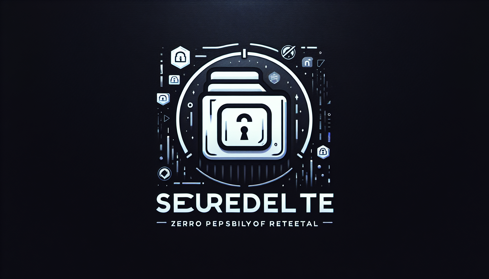

# SecureDelete 🗑️

SecureDelete is a Java tool designed to securely delete files and directories from your system. By overwriting the data multiple times with random patterns and zeros, it ensures that sensitive information is irretrievable.

## Features 🌟

- Securely deletes files and directories
- Overwrites data with random bytes and fixed patterns
- User-friendly command-line interface

## Techniques Used 🔒

SecureDelete employs the following techniques to ensure data is unrecoverable:

1. **Multiple Overwrites**: The tool overwrites the file data several times to prevent recovery. 
   - First pass: Random data
   - Second pass: Zeros
   - Third pass: Random data
   - Final pass: Fixed pattern (0xFF)

2. **Directory Deletion**: If a directory is specified, SecureDelete recursively deletes all files and subdirectories within it.

3. **Execution Time Measurement**: It tracks the total time taken to securely delete files.

4. Follow the prompt to enter the file or directory path you wish to delete.

## Installation ⚙️

You can download the latest release from [here](https://github.com/lalaio1/SecureDelete/releases/tag/SecureDelete).

| Platform      | Download Link                                            |
|---------------|---------------------------------------------------------|
| Windows       | [Download SecureDelete](https://github.com/lalaio1/SecureDelete/releases/tag/SecureDelete) |
| Linux         | Build from source (instructions coming soon!)           |

## Contributing 🤝

Contributions are welcome! If you have suggestions or improvements, feel free to open an issue or submit a pull request.

## License 📄

This project is licensed under the MIT License. See the [LICENSE](LICENSE) file for details.

## Acknowledgements 🙏

- Java Development Kit (JDK)
- GitHub for hosting the repository

## Contact 📬

For any questions or support, feel free to reach out via GitHub.
